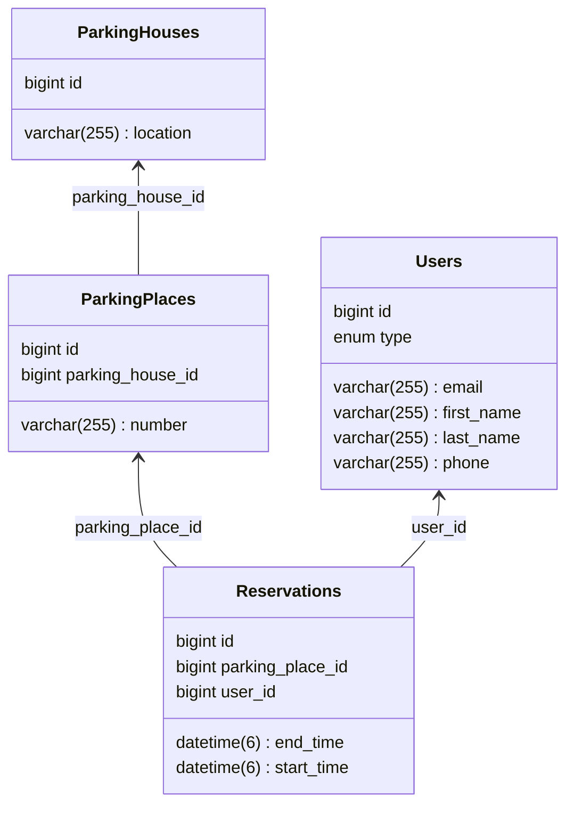

## Parking Space Reservation System Project

This project aims to create an application that allows for the reservation of parking spaces in a company parking lot for specific hours during the week.

### System Features:
- **User List**: Stores information about users who can reserve parking spaces.
- **Parking House List**: Stores information about available parking locations. Includes forms for adding and editing, and allows for deletion.
- **Parking Space List**: Stores information about available parking spaces. Includes forms for adding and editing, and allows for deletion.
- **Reservation List for a Given Parking Space**: Stores information about made reservations, including the user who made the reservation, the reserved space, and the reservation time.

#### Must Have
- The system should search for available spaces for a specified day and time range.
- Spaces already reserved for a given day should not be available for reservation.
- Reservations for UNLIMITED users can be made for any time in the future.
- Reservations for LIMITED users can be made up to one week in advance.
- Reservations can be removed from the system before the parking time starts.

#### Optional
- In the next step, add authorization, using the logged-in user for reservations. Only admin can edit parking spaces and delete other users' reservations.

The system will consist of four main tables in the database: parking houses, parking users, parking spaces, and reservations.

### Tools:
- Spring Boot
- Lombok
- Spring Data JPA
- JSP
- Materialize CSS
- MySQL

### Database Schema Diagram

